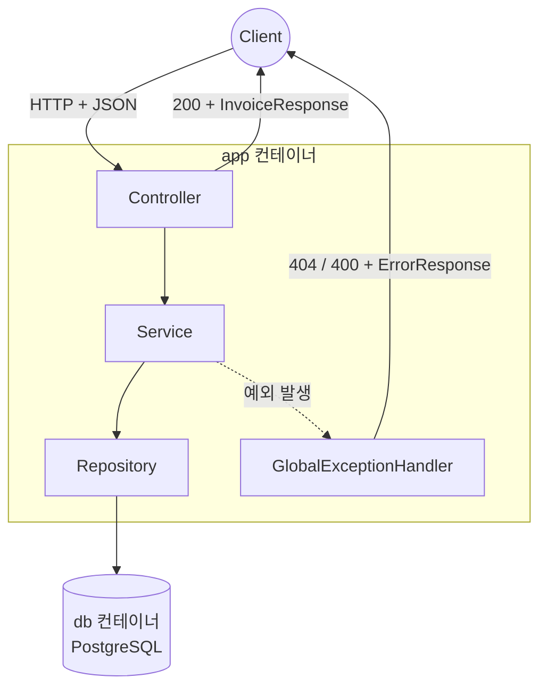
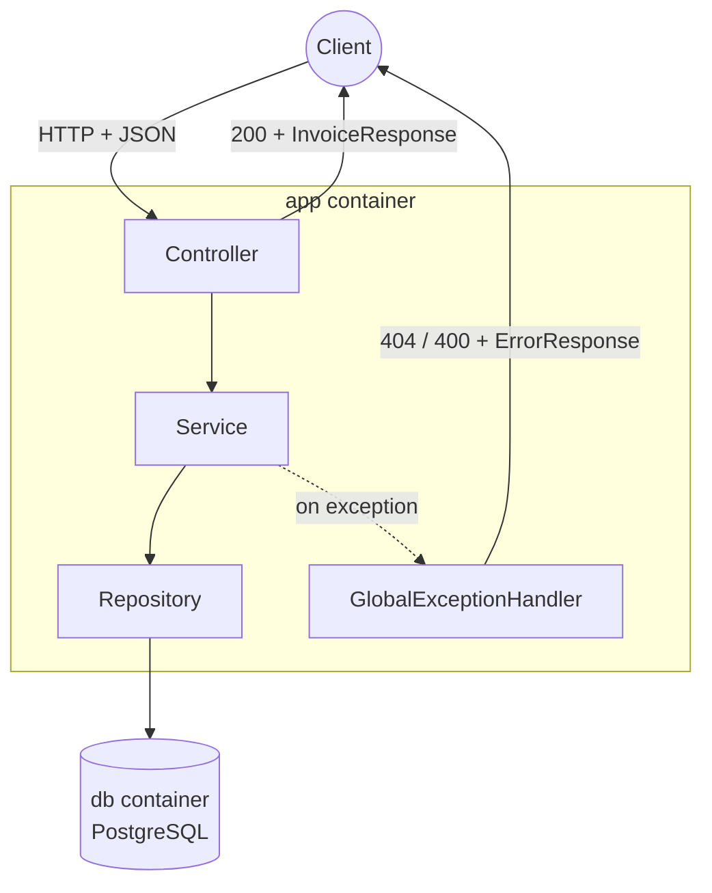

# invoice-app

## 한국어

### 소개

인보이스·영수증을 관리하는 백엔드 API입니다. Java 21과 Spring Boot로 3계층 구조(Controller-Service-Repository)를 밑바닥부터 익히며 만든 학습용 포트폴리오 프로젝트로, DB와 애플리케이션 모두 Docker로 컨테이너화되어 있습니다.

### 실행 방법

**Docker로 한 번에 (권장)** — 로컬에 JDK·Maven 설치 없이 바로 실행됩니다.

```bash
docker compose up --build
```

`GET http://localhost:8080/invoices`로 확인할 수 있습니다.

**로컬 개발 모드** — 코드를 직접 수정하며 실행할 때 (JDK 21 필요).

```bash
docker compose up -d db      # DB만 컨테이너로 띄우고
./mvnw spring-boot:run       # 앱은 로컬에서 실행 (핫리로드 가능)
```

> 두 방식의 차이는 "개발 환경"과 "실행 환경"의 차이입니다 — 코드를 고치려면 로컬 JDK·IDE가 필요하지만, 완성된 앱을 그냥 실행만 하고 싶다면 Docker 이미지 하나로 충분합니다.

### 스택

Java 21 · Spring Boot · Spring Data JPA · PostgreSQL · Docker / Docker Compose

### API

| Method | Path | Body | 설명 |
|---|---|---|---|
| `POST` | `/invoices` | `InvoiceRequest` | 인보이스 생성 |
| `GET` | `/invoices` | – | 전체 목록 조회 |
| `GET` | `/invoices?storeName=...` | – | 상점 이름에 검색어가 포함된 인보이스만 조회 |
| `GET` | `/invoices/{id}` | – | 단건 조회 |
| `PUT` | `/invoices/{id}` | `InvoiceRequest` | 수정 |
| `DELETE` | `/invoices/{id}` | – | 삭제 |

**`InvoiceRequest`** (요청 body): `storeName`(String), `amount`(양수), `issuedAt`(날짜시간), `category`(String) — 전부 필수, `@Valid`로 검증됨.

**에러 응답** — 존재하지 않는 id 조회/수정/삭제 시 404, 입력 검증 실패 시 400. 둘 다 같은 형태:

```json
{ "message": "...", "status": 404 }
```

### 아키텍처



Controller는 HTTP만 다루고, 실제 로직은 Service, DB 접근은 Repository(Spring Data JPA 동적 프록시)가 담당합니다. 예외는 `@RestControllerAdvice`가 한곳에서 잡아 통일된 JSON으로 응답합니다.

### 배운 것

- Spring Boot의 3계층 구조(Controller/Service/Repository)와 각 계층의 책임
- Spring Data JPA가 인터페이스만으로 동작하는 이유(동적 프록시), 쿼리 메서드 이름만으로 SQL이 만들어지는 원리
- DTO로 Entity를 감춰야 하는 이유, 계층 간 변환 로직의 위치
- `@RestControllerAdvice` + `@ExceptionHandler`로 예외를 한곳에서 처리하고 응답 형태를 통일하는 방법
- Docker 멀티스테이지 빌드로 빌드 도구와 실행 환경을 분리하는 이유, 컨테이너 간 네트워킹(서비스 이름 = 호스트 이름)

---

## English

### Overview

A backend API for managing invoices and receipts. A learning-portfolio project built from scratch with Java 21 and Spring Boot, following a 3-layer architecture (Controller-Service-Repository). Both the database and the application are containerized with Docker.

### Running it

**With Docker (recommended)** — no local JDK/Maven install needed.

```bash
docker compose up --build
```

Check it at `GET http://localhost:8080/invoices`.

**Local dev mode** — for editing code and running it directly (requires JDK 21).

```bash
docker compose up -d db      # just the DB, containerized
./mvnw spring-boot:run       # app runs locally (hot reload)
```

> The difference between the two is "development environment" vs "runtime environment" — editing code needs a local JDK/IDE, but just running the finished app only needs the Docker image.

### Stack

Java 21 · Spring Boot · Spring Data JPA · PostgreSQL · Docker / Docker Compose

### API

| Method | Path | Body | Description |
|---|---|---|---|
| `POST` | `/invoices` | `InvoiceRequest` | Create an invoice |
| `GET` | `/invoices` | – | List all invoices |
| `GET` | `/invoices?storeName=...` | – | List invoices whose store name contains the search term |
| `GET` | `/invoices/{id}` | – | Get one invoice |
| `PUT` | `/invoices/{id}` | `InvoiceRequest` | Update an invoice |
| `DELETE` | `/invoices/{id}` | – | Delete an invoice |

**`InvoiceRequest`** (request body): `storeName`(String), `amount`(positive number), `issuedAt`(datetime), `category`(String) — all required, validated with `@Valid`.

**Error response** — 404 for a missing id (get/update/delete), 400 for validation failures. Both share the same shape:

```json
{ "message": "...", "status": 404 }
```

### Architecture



The Controller only handles HTTP, the Service holds the actual logic, and the Repository (a Spring Data JPA dynamic proxy) talks to the DB. Exceptions are caught in one place by `@RestControllerAdvice` and returned as a unified JSON shape.

### What I learned

- The 3-layer architecture (Controller/Service/Repository) and each layer's responsibility
- Why Spring Data JPA works with just an interface (dynamic proxies), and how query methods turn a method name into SQL
- Why DTOs hide the Entity, and where conversion logic belongs
- Handling exceptions in one place with `@RestControllerAdvice` + `@ExceptionHandler` for a unified error response
- Why Docker multi-stage builds separate build tools from the runtime, and how container networking (service name = host name) works
